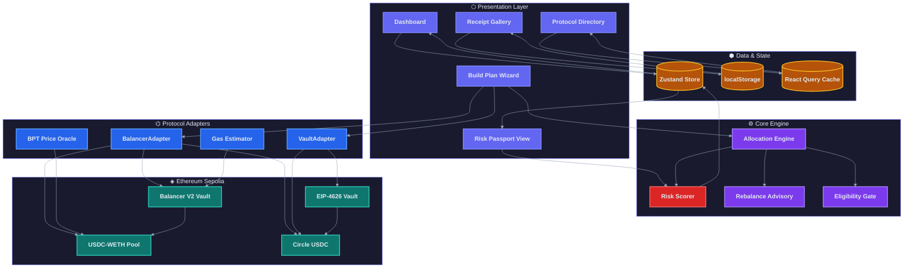
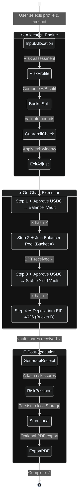
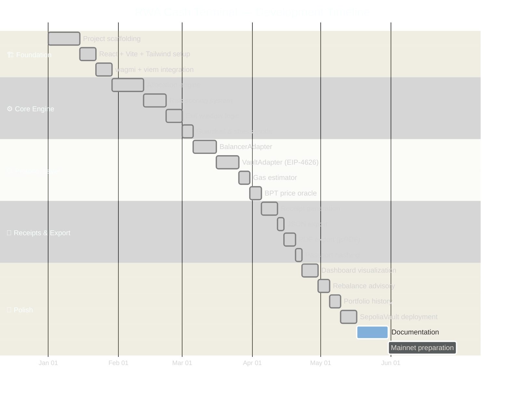
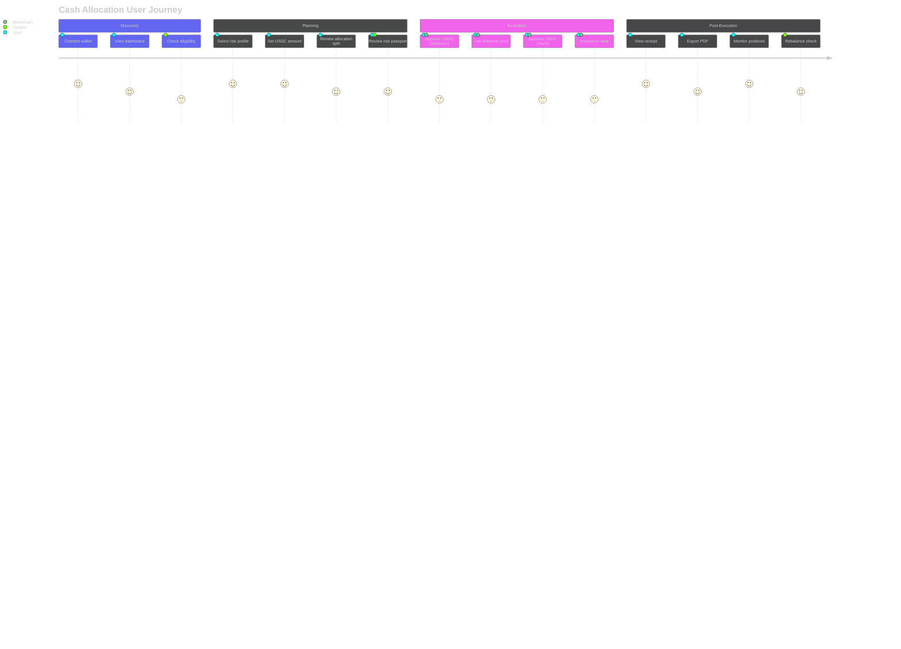

<div align="center">

<!-- ═══════════════════════════════════════════════════════════════════════ -->
<!-- ✦  HERO SECTION                                                       -->
<!-- ═══════════════════════════════════════════════════════════════════════ -->

<br>

<picture>
  <source media="(prefers-color-scheme: dark)" srcset="https://capsule-render.vercel.app/api?type=waving&color=0:0f0c29,50:302b63,100:6366f1&height=300&section=header&text=RWA%20Cash%20Terminal&fontSize=60&fontColor=e2e8f0&fontAlignY=35&desc=Institutional-Grade%20DeFi%20Cash%20Management%20on%20Ethereum%20Sepolia&descSize=18&descColor=94a3b8&descAlignY=55&animation=fadeIn"/>
  <source media="(prefers-color-scheme: light)" srcset="https://capsule-render.vercel.app/api?type=waving&color=0:e2e8f0,50:6366f1,100:302b63&height=300&section=header&text=RWA%20Cash%20Terminal&fontSize=60&fontColor=0f172a&fontAlignY=35&desc=Institutional-Grade%20DeFi%20Cash%20Management%20on%20Ethereum%20Sepolia&descSize=18&descColor=475569&descAlignY=55&animation=fadeIn"/>
  
</picture>

<br>

<!--  Glass-Textured Badge Row  -->

[](https://react.dev)
[](https://www.typescriptlang.org)
[](https://vitejs.dev)
[](https://tailwindcss.com)
[](https://ethereum.org)
[](https://balancer.fi)
[](https://wagmi.sh)

<br>

<!--  Status Badges  -->


<br>

```
  ╔══════════════════════════════════════════════════════════════════╗
  ║                                                                  ║
  ║   ⌬  Two-Bucket Allocation  ·  Risk Passport  ·  On-Chain Exec  ║
  ║   ✦  Verifiable Tx Hashes   ·  PDF Receipts   ·  EIP-4626 Vault ║
  ║                                                                  ║
  ╚══════════════════════════════════════════════════════════════════╝
```

<br>

**`font-stack: 'Inter', 'JetBrains Mono', system-ui, sans-serif`**

</div>

<!-- ═══════════════════════════════════════════════════════════════════════ -->
<!--  ⚡  NEON DIVIDER                                                     -->
<!-- ═══════════════════════════════════════════════════════════════════════ -->


<br>

## ✦ Overview

> **RWA Cash Terminal** is an institutional-grade DeFi cash-management terminal built on **Ethereum Sepolia**. It recommends and executes a **two-bucket allocation strategy** — combining **Balancer V2 LP** (RWA proxy) with an **EIP-4626 Stable Yield Vault** — producing verifiable on-chain transaction hashes, a risk passport, and auditable PDF receipts.

<br>

<!-- ═══════════════════════════════════════════════════════════════════════ -->
<!--  ⚙  FEATURE GRID                                                     -->
<!-- ═══════════════════════════════════════════════════════════════════════ -->

## ⚙ Feature Grid

<table>
<tr>
<td width="33%" valign="top">

### 🪣 Dual-Bucket Engine

<sub>**`allocation-engine`**</sub>

Three risk profiles with guardrails, exit-window adjustments, and stress-mode caps. Expected APR band derived from allocation weights.

**Conservative** `60 / 40`
**Balanced** `45 / 55`
**Yield-Seeking** `30 / 70`

</td>
<td width="33%" valign="top">

### 🛡 Risk Passport

<sub>**`risk-passport`**</sub>

Five-dimensional risk scoring — Smart Contract, Liquidity, Oracle, Market, Operational — with per-bucket and portfolio-level letter grades.

**A** `≥ 80` · **B** `65–79` · **C** `< 65`

</td>
<td width="33%" valign="top">

### ⚡ On-Chain Execution

<sub>**`protocol-adapters`**</sub>

4-step atomic execution flow: Approve → Balancer Join → Approve → Vault Deposit. Every step returns a verifiable Etherscan tx hash.

**Protocols** `Balancer V2 · EIP-4626`

</td>
</tr>
<tr>
<td width="33%" valign="top">

### 📄 Receipt System

<sub>**`receipt-gallery`**</sub>

Per-plan receipts with inputs, allocation snapshot, risk passport, and tx hashes. Export to **JSON** and **PDF** (jsPDF). Stored in localStorage.

</td>
<td width="33%" valign="top">

### 📊 Live Dashboard

<sub>**`dashboard`**</sub>

On-chain position monitoring — USDC balance, BPT holdings, vault shares, total liquidity, and APY. Powered by **Recharts** visualizations.

</td>
<td width="33%" valign="top">

### ⚖ Rebalance Advisory

<sub>**`rebalance-advisory`**</sub>

Drift detection with **8% threshold** triggering rebalance recommendations. Advisory-only — no auto-execution. Visual drift indicators.

</td>
</tr>
</table>

<br>


<br>

<!-- ═══════════════════════════════════════════════════════════════════════ -->
<!--  ⌬  ARCHITECTURE DIAGRAM                                              -->
<!-- ═══════════════════════════════════════════════════════════════════════ -->

## ⌬ System Architecture



<br>

<details>
<summary><b>✦ Execution Flow — 4-Step On-Chain Pipeline</b></summary>
<br>



</details>

<br>


<br>

<!-- ═══════════════════════════════════════════════════════════════════════ -->
<!--  🔧 TECH STACK                                                        -->
<!-- ═══════════════════════════════════════════════════════════════════════ -->

## ⬡ Tech Stack

<table>
<tr>
<th align="center">Layer</th>
<th align="center">Technology</th>
<th align="center">Version</th>
<th align="center">Role</th>
</tr>
<tr><td><b>⬡ UI Framework</b></td><td>React</td><td><code>19.0</code></td><td>Component architecture</td></tr>
<tr><td><b>⌬ Language</b></td><td>TypeScript</td><td><code>5.8</code></td><td>Type safety</td></tr>
<tr><td><b>⚡ Build</b></td><td>Vite</td><td><code>6.2</code></td><td>Dev server & bundler</td></tr>
<tr><td><b>🎨 Styling</b></td><td>Tailwind CSS</td><td><code>4.1</code></td><td>Utility-first CSS</td></tr>
<tr><td><b>🔗 Web3 Client</b></td><td>wagmi + viem</td><td><code>3.5 / 2.46</code></td><td>Ethereum interaction</td></tr>
<tr><td><b>📦 State</b></td><td>Zustand</td><td><code>5.0</code></td><td>Global state management</td></tr>
<tr><td><b>🔄 Data Fetching</b></td><td>TanStack React Query</td><td><code>5.90</code></td><td>Async state & caching</td></tr>
<tr><td><b>🧭 Routing</b></td><td>React Router DOM</td><td><code>7.13</code></td><td>Client-side routing</td></tr>
<tr><td><b>📊 Charts</b></td><td>Recharts</td><td><code>3.7</code></td><td>Data visualization</td></tr>
<tr><td><b>✨ Animation</b></td><td>Motion (Framer)</td><td><code>12.23</code></td><td>UI transitions</td></tr>
<tr><td><b>📄 PDF</b></td><td>jsPDF</td><td><code>4.2</code></td><td>Receipt export</td></tr>
<tr><td><b>🤖 AI</b></td><td>Google Gemini</td><td><code>1.29</code></td><td>AI Studio integration</td></tr>
<tr><td><b>🔐 Smart Contract</b></td><td>Solidity (EIP-4626)</td><td><code>0.8.x</code></td><td>Stable yield vault</td></tr>
</table>

<br>


<br>

<!-- ═══════════════════════════════════════════════════════════════════════ -->
<!--  🚀 INSTALLATION                                                      -->
<!-- ═══════════════════════════════════════════════════════════════════════ -->

## ◈ Getting Started

<details open>
<summary><b>✦ Prerequisites</b></summary>
<br>

| Requirement | Minimum |
|------------|---------|
| **Node.js** | `≥ 18.x` |
| **npm** | `≥ 9.x` |
| **Wallet** | MetaMask or any injected provider |
| **Network** | Ethereum Sepolia testnet |
| **USDC** | Circle faucet (20 USDC / 2h / address) |

</details>

<br>

<details open>
<summary><b>✦ Installation</b></summary>
<br>

```bash
# ─────────────────────────────────────────────────────
#  ⌬  Clone the repository
# ─────────────────────────────────────────────────────
git clone https://github.com/your-org/rwa-cash-terminal.git
cd rwa-cash-terminal

# ─────────────────────────────────────────────────────
#  ⚙  Install dependencies
# ─────────────────────────────────────────────────────
npm install

# ─────────────────────────────────────────────────────
#  ✦  Configure environment  (optional — for AI features)
# ─────────────────────────────────────────────────────
cp .env.example .env.local
# → Set GEMINI_API_KEY=your_key_here

# ─────────────────────────────────────────────────────
#  ⚡  Launch dev server
# ─────────────────────────────────────────────────────
npm run dev
# → Server running at http://localhost:3000
```

</details>

<br>

<details>
<summary><b>✦ Available Scripts</b></summary>
<br>

```
┌──────────────────┬──────────────────────────────────────────────┐
│  Command          │  Description                                 │
├──────────────────┼──────────────────────────────────────────────┤
│  npm run dev      │  Start Vite dev server on port 3000          │
│  npm run build    │  Production build → dist/                    │
│  npm run preview  │  Preview production build                    │
│  npm run clean    │  Remove dist/ directory                      │
│  npm run lint     │  TypeScript type-check (tsc --noEmit)        │
└──────────────────┴──────────────────────────────────────────────┘
```

</details>

<br>


<br>

<!-- ═══════════════════════════════════════════════════════════════════════ -->
<!--  📁 PROJECT STRUCTURE                                                  -->
<!-- ═══════════════════════════════════════════════════════════════════════ -->

## ⬢ Project Structure

<details open>
<summary><b>✦ Directory Map</b></summary>
<br>

> **Repository:** `rwa-cash-terminal` · **RWA Cash Terminal**

```
rwa-cash-terminal/
│
├── 📄 index.html                          # Entry HTML
├── 📄 package.json                        # Dependencies & scripts
├── 📄 vite.config.ts                      # Vite + Tailwind + env config
├── 📄 tsconfig.json                       # TypeScript config
├── 📄 SPEC_real_protocols.md              # Protocol integration spec
│
├── 📂 src/
│   ├── main.tsx                           # React root
│   ├── App.tsx                            # Router + providers
│   │
│   ├── 📂 components/
│   │   └── Layout.tsx                     # ◈ Layout component
│   │
│   ├── 📂 pages/
│   │   ├── Dashboard.tsx                  # ◈ Portfolio overview
│   │   ├── BuildPlan.tsx                  # ◈ 4-step execution wizard
│   │   ├── RiskPassport.tsx               # ◈ 5-dimension risk scoring
│   │   ├── PassportSnapshot.tsx           # ◈ Per-plan passport view
│   │   ├── ReceiptGallery.tsx             # ◈ All receipts list
│   │   ├── ReceiptDetail.tsx              # ◈ Single receipt detail
│   │   └── ProtocolDirectory.tsx          # ◈ Contract addresses
│   │
│   ├── 📂 packages/
│   │   ├── allocation-engine/
│   │   │   └── index.ts                   # ⚙ Profile → bucket split
│   │   └── protocol-adapters/
│   │       ├── index.ts                   # Adapter exports
│   │       ├── BalancerAdapter.ts         # ⌬ Balancer V2 join/exit
│   │       ├── VaultAdapter.ts            # ⌬ EIP-4626 deposit/withdraw
│   │       └── types.ts                   # ⌬ Adapter interfaces
│   │
│   ├── 📂 config/
│   │   ├── sepolia.json                   # ✦ Contract addresses
│   │   ├── allocationConfig.ts            # ✦ Profile parameters
│   │   ├── riskDefaults.ts                # ✦ Risk vector defaults
│   │   ├── abis.ts                        # ✦ Contract ABIs
│   │   └── wagmi.ts                       # ✦ wagmi client setup
│   │
│   ├── 📂 store/
│   │   └── index.ts                       # Zustand global store
│   │
│   ├── 📂 utils/
│   │   ├── protocolData.ts                # APR fetching
│   │   ├── onChainPositions.ts            # Position queries
│   │   ├── bptPriceOracle.ts              # BPT pricing
│   │   ├── gasEstimator.ts                # Gas estimation
│   │   ├── rebalanceAdvisory.ts           # Drift detection
│   │   ├── eligibilityCheck.ts            # Access gating
│   │   ├── receiptExport.ts               # JSON/PDF export
│   │   ├── passportPdf.ts                 # Passport PDF render
│   │   ├── portfolioHistory.ts            # History snapshots
│   │   ├── riskDataProvider.ts            # Risk data utilities
│   │   ├── riskStatus.ts                  # Risk status helpers
│   │   ├── configValidator.ts             # Config validation
│   │   └── parseReceivedAmount.ts         # Amount parsing
│   │
│   └── 📂 types/
│       └── index.ts                       # Shared type definitions
│
├── 📂 balancer-pool-deploy/
│   ├── script/deploy.ts                   # Pool deployment script
│   ├── contract/SepoliaVault.sol           # EIP-4626 vault contract
│   └── output/deployment.json             # Deployment artifacts
```

</details>

<br>


<br>

<!-- ═══════════════════════════════════════════════════════════════════════ -->
<!--  ⌬  ALLOCATION ENGINE                                                 -->
<!-- ═══════════════════════════════════════════════════════════════════════ -->

## ⌬ Allocation Engine — Deep Dive

```mermaid
%%{init: {'theme': 'dark', 'themeVariables': { 'primaryColor': '#6366f1', 'primaryTextColor': '#e2e8f0', 'lineColor': '#94a3b8', 'secondaryColor': '#1e1b4b' }}}%%

graph LR
    classDef conservative fill:#059669,stroke:#34d399,stroke-width:2px,color:#e2e8f0
    classDef balanced fill:#6366f1,stroke:#818cf8,stroke-width:2px,color:#e2e8f0
    classDef aggressive fill:#dc2626,stroke:#f87171,stroke-width:2px,color:#e2e8f0
    classDef bucket fill:#1e1b4b,stroke:#6366f1,stroke-width:1px,color:#94a3b8

    INPUT[/"💰 USDC Input"/] --> PROFILE{Risk Profile?}

    PROFILE -->|Conservative| C["60% A · 40% B"]:::conservative
    PROFILE -->|Balanced| B["45% A · 55% B"]:::balanced
    PROFILE -->|Yield-Seeking| Y["30% A · 70% B"]:::aggressive

    C --> EXIT["Exit Window Adjustment"]
    B --> EXIT
    Y --> EXIT

    EXIT -->|T+0| T0["-20% from Bucket A"]:::bucket
    EXIT -->|T+3| T3["-10% from Bucket A"]:::bucket
    EXIT -->|T+7| T7["+5% to Bucket A"]:::bucket

    T0 --> GUARD["Guardrail Check"]
    T3 --> GUARD
    T7 --> GUARD

    GUARD --> STRESS{"Stress Mode?"}
    STRESS -->|Yes| CAP["Cap A ≤ 20%"]:::aggressive
    STRESS -->|No| BOUNDS["A ∈ 0%..70%"]:::conservative

    CAP --> FINAL["Final Split"]
    BOUNDS --> FINAL

    FINAL --> BA["🪣 Bucket A — Balancer LP"]:::balanced
    FINAL --> BB["🪣 Bucket B — EIP-4626 Vault"]:::balanced
```

<details>
<summary><b>✦ Risk Profiles & Bucket Split Logic</b></summary>
<br>



<br>

| Parameter | Conservative | Balanced | Yield-Seeking |
|-----------|:------------:|:--------:|:-------------:|
| **Bucket A (Balancer LP)** | `60%` | `45%` | `30%` |
| **Bucket B (Stable Vault)** | `40%` | `55%` | `70%` |
| **Rebalance Threshold** | `8%` | `8%` | `8%` |
| **Stress Cap (Bucket A)** | `≤ 20%` | `≤ 20%` | `≤ 20%` |
| **Bounds (Bucket A)** | `0–70%` | `0–70%` | `0–70%` |

</details>

<br>

<details>
<summary><b>✦ Risk Passport — Five-Dimensional Scoring</b></summary>
<br>



<br>

```mermaid
%%{init: {'theme': 'dark', 'themeVariables': { 'primaryColor': '#6366f1', 'primaryTextColor': '#e2e8f0', 'lineColor': '#94a3b8' }}}%%

graph TD
    classDef high fill:#059669,stroke:#34d399,stroke-width:2px,color:#e2e8f0
    classDef med fill:#d97706,stroke:#fbbf24,stroke-width:2px,color:#e2e8f0
    classDef low fill:#dc2626,stroke:#f87171,stroke-width:2px,color:#e2e8f0
    classDef center fill:#6366f1,stroke:#818cf8,stroke-width:3px,color:#e2e8f0

    CENTER["🛡 RISK PASSPORT"]:::center

    CENTER --> SC["Smart Contract Risk"]
    CENTER --> LQ["Liquidity / Exit Risk"]
    CENTER --> OR["Oracle / Pricing Risk"]
    CENTER --> MK["Market Risk"]
    CENTER --> OP["Operational Risk"]

    SC --> SCA["Bucket A: Balancer audit"]:::high
    SC --> SCB["Bucket B: EIP-4626 standard"]:::high

    LQ --> LQA["Bucket A: DEX liquidity"]:::med
    LQ --> LQB["Bucket B: Vault redemption"]:::high

    OR --> ORA["Bucket A: Pool pricing"]:::med
    OR --> ORB["Bucket B: Share price"]:::high

    MK --> MKA["Bucket A: IL exposure"]:::med
    MK --> MKB["Bucket B: Stablecoin peg"]:::high

    OP --> OPA["Bucket A: Protocol gov"]:::med
    OP --> OPB["Bucket B: Admin keys"]:::med
```

**Grading Scale**

| Grade | Score Range | Meaning |
|:-----:|:----------:|---------|
| **A** | `≥ 80` | Low risk — production-audited protocols |
| **B** | `65 – 79` | Moderate risk — standard DeFi exposure |
| **C** | `< 65` | Elevated risk — additional monitoring required |

</details>

<br>


<br>

<!-- ═══════════════════════════════════════════════════════════════════════ -->
<!--  ◈  PROTOCOL CONTRACTS                                                -->
<!-- ═══════════════════════════════════════════════════════════════════════ -->

## ◈ Protocol Contracts — Sepolia

<table>
<tr>
<th align="left">Protocol</th>
<th align="left">Component</th>
<th align="left">Address</th>
</tr>
<tr>
<td><b>Balancer V2</b></td>
<td>Vault</td>
<td><code>0xBA12222222228d8Ba445958a75a0704d566BF2C8</code></td>
</tr>
<tr>
<td><b>Balancer V2</b></td>
<td>USDC-WETH Pool (BPT)</td>
<td><code>0x440953587224069bEa16c06946a9F092915f0c75</code></td>
</tr>
<tr>
<td><b>Stable Yield</b></td>
<td>EIP-4626 Vault</td>
<td><code>0xbeEE823aF197043bdD41703eAF239F97DDE89253</code></td>
</tr>
<tr>
<td><b>Circle</b></td>
<td>USDC (Sepolia)</td>
<td><code>0x1c7D4B196Cb0C7B01d743Fbc6116a902379C7238</code></td>
</tr>
<tr>
<td><b>Wrapped ETH</b></td>
<td>WETH (Sepolia)</td>
<td><code>0x7b79995e5f793A07Bc00c21412e50Ecae098E7f9</code></td>
</tr>
</table>

<br>

<details>
<summary><b>✦ SepoliaVault.sol — EIP-4626 Implementation</b></summary>
<br>

```solidity
// SPDX-License-Identifier: MIT
// OpenZeppelin ERC4626 + Ownable + ReentrancyGuard

contract SepoliaVault is ERC4626, Ownable, ReentrancyGuard {
    uint256 public aprBps;          // Annual rate in basis points
    uint256 public blocksPerYear;   // Block cadence for yield calc
    uint256 public lastYieldBlock;  // Last compounded block

    function totalAssets() public view override returns (uint256) {
        // Virtual yield via per-block compound interest
        return _underlyingBalance + _accruedYield();
    }

    function injectYield(uint256 amount) external onlyOwner {
        // Manual yield injection for demo/testing
    }
}
```

</details>

<br>


<br>

<!-- ═══════════════════════════════════════════════════════════════════════ -->
<!--  🗺️ ROUTES                                                            -->
<!-- ═══════════════════════════════════════════════════════════════════════ -->

## 🧭 Route Map

```
┌─────────────────────────────────┬────────────────────────────────────────┐
│  Route                           │  Page                                  │
├─────────────────────────────────┼────────────────────────────────────────┤
│  /                               │  ◈ Dashboard — Portfolio overview      │
│  /terminal/build                 │  ⚡ Build Plan — Execution wizard      │
│  /terminal/passport              │  🛡 Risk Passport — Scoring view       │
│  /terminal/passport/:planId      │  🛡 Passport Snapshot — Per-plan       │
│  /terminal/receipts              │  📄 Receipt Gallery — All receipts     │
│  /terminal/receipt/:receiptId    │  📄 Receipt Detail — Single receipt    │
│  /terminal/protocols             │  ◈ Protocol Directory — Addresses      │
└─────────────────────────────────┴────────────────────────────────────────┘
```

<br>


<br>

<!-- ═══════════════════════════════════════════════════════════════════════ -->
<!--  📊 PROJECT ROADMAP                                                    -->
<!-- ═══════════════════════════════════════════════════════════════════════ -->

## 📊 Project Roadmap



<br>


<br>

<!-- ═══════════════════════════════════════════════════════════════════════ -->
<!--  🗺 USER JOURNEY                                                      -->
<!-- ═══════════════════════════════════════════════════════════════════════ -->

## 🗺 User Journey



<br>


<br>

<!-- ═══════════════════════════════════════════════════════════════════════ -->
<!--  🔧 ENVIRONMENT                                                       -->
<!-- ═══════════════════════════════════════════════════════════════════════ -->

## 🔐 Environment Variables

<details>
<summary><b>✦ Application (.env.local)</b></summary>
<br>

| Variable | Required | Description |
|----------|:--------:|-------------|
| `GEMINI_API_KEY` | Optional | Google Gemini API key for AI Studio features |
| `DISABLE_HMR` | Optional | Set `"true"` to disable Vite HMR (AI Studio compat) |

</details>

<details>
<summary><b>✦ Balancer Pool Deployment (balancer-pool-deploy/.env)</b></summary>
<br>

| Variable | Required | Description |
|----------|:--------:|-------------|
| `DEPLOYER_PRIVATE_KEY` | ✅ | Deployer wallet private key |
| `SEPOLIA_RPC_URL` | ✅ | Sepolia JSON-RPC endpoint |
| `INITIAL_USDC` | ○ | Initial USDC liquidity (default: `30`) |
| `INITIAL_WETH` | ○ | Initial WETH liquidity (default: `0.01`) |

</details>

<br>


<br>

<!-- ═══════════════════════════════════════════════════════════════════════ -->
<!--  📚  DOCUMENTATION                                                    -->
<!-- ═══════════════════════════════════════════════════════════════════════ -->

## 📚 Documentation

| Document | Description |
|----------|-------------|
| **📋 Protocol Spec** | [`SPEC_real_protocols.md`](./SPEC_real_protocols.md) — Full protocol integration specification with allocation rules, risk definitions, and execution pipeline. |

<br>


<br>

<!-- ═══════════════════════════════════════════════════════════════════════ -->
<!--  🤝 CONTRIBUTING                                                      -->
<!-- ═══════════════════════════════════════════════════════════════════════ -->

## 🤝 Contributing

<details>
<summary><b>✦ Development Workflow</b></summary>
<br>

```bash
# ─── Fork & Clone ───────────────────────────────────
git clone https://github.com/your-username/rwa-cash-terminal.git
cd rwa-cash-terminal

# ─── Create Feature Branch ─────────────────────────
git checkout -b feat/your-feature-name

# ─── Install & Develop ─────────────────────────────
npm install
npm run dev

# ─── Type Check ────────────────────────────────────
npm run lint

# ─── Commit & Push ─────────────────────────────────
git add .
git commit -m "feat: your feature description"
git push origin feat/your-feature-name
```

</details>

<br>

<!-- ═══════════════════════════════════════════════════════════════════════ -->
<!--  📜 LICENSE & FOOTER                                                  -->
<!-- ═══════════════════════════════════════════════════════════════════════ -->

<div align="center">

<br>


<br>

```
  ╔══════════════════════════════════════════════════════════════════╗
  ║                                                                  ║
  ║   Built with ⌬ precision on Ethereum Sepolia                     ║
  ║   React 19  ·  TypeScript  ·  Balancer V2  ·  EIP-4626          ║
  ║                                                                  ║
  ╚══════════════════════════════════════════════════════════════════╝
```

<br>

**MIT License** · Built with ✦ by the RWA Cash Terminal team

<br>

<picture>
  <source media="(prefers-color-scheme: dark)" srcset="https://capsule-render.vercel.app/api?type=waving&color=0:6366f1,50:302b63,100:0f0c29&height=120&section=footer"/>
  <source media="(prefers-color-scheme: light)" srcset="https://capsule-render.vercel.app/api?type=waving&color=0:302b63,50:6366f1,100:e2e8f0&height=120&section=footer"/>
  
</picture>

</div>
